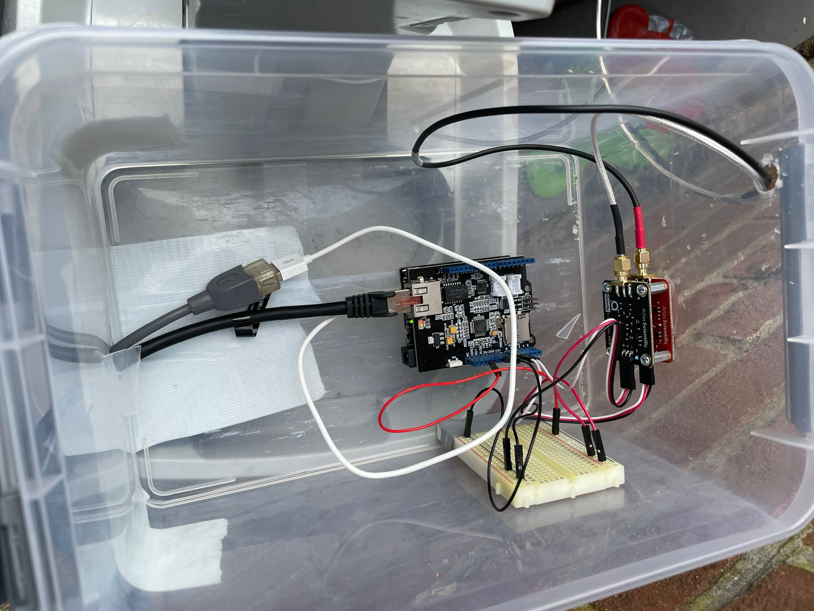

# Arduino Spa Monitor
Goal is to monitor:
- pH
- ORP
- Temperature

## Used hardware
- Adafruit Metro  [?]
- Ethernet kit [?]
- pH sensor van Atlas Scientific [https://www.robesol.nl/nl/ph-sensor-consumenten-kwaliteit-98671032.html] i.c.m. Gravity™ Analoge pH Sensor / Meter [https://www.robesol.nl/nl/gravity-analoge-ph-sensor-meter.html]
- ORP sensor van Atlas Scientific [https://www.robesol.nl/nl/orp-sensor-consumenten-kwaliteit-98671539.html] i.c.m. Gravity™ Analoge ORP Sensor [https://www.robesol.nl/nl/gravity-analoge-orp-sensor-meter.html]
- Temperatuur sensor van Atlas Scientific [https://www.robesol.nl/nl/standaard-temperatuur-sensor-132615142.html] i.c.m. Gravity™ Analog Temperature Sensor / Meter [https://www.robesol.nl/nl/gravity-analog-temperature-sensor-meter-133156296.html]

## Example output for JSON API
```
{
    "ph": 7.33,
    "temperature": 37.44,
    "orp": 659
}
```

## Setup in real world


